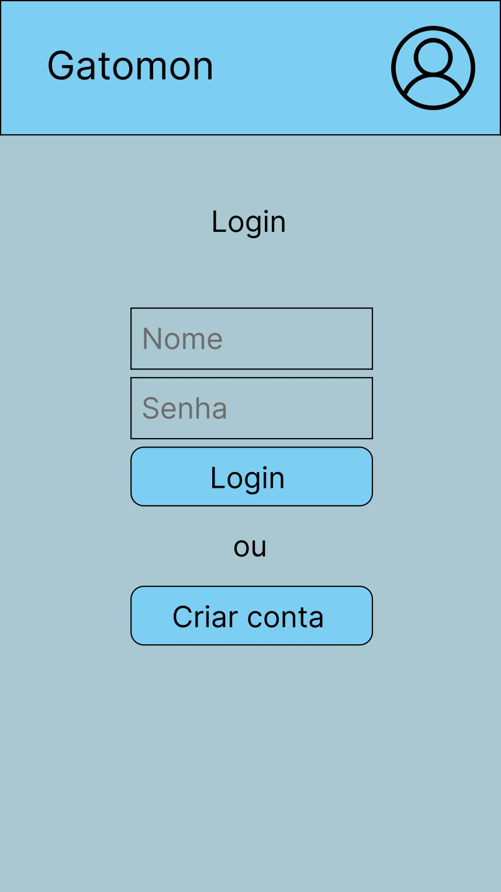
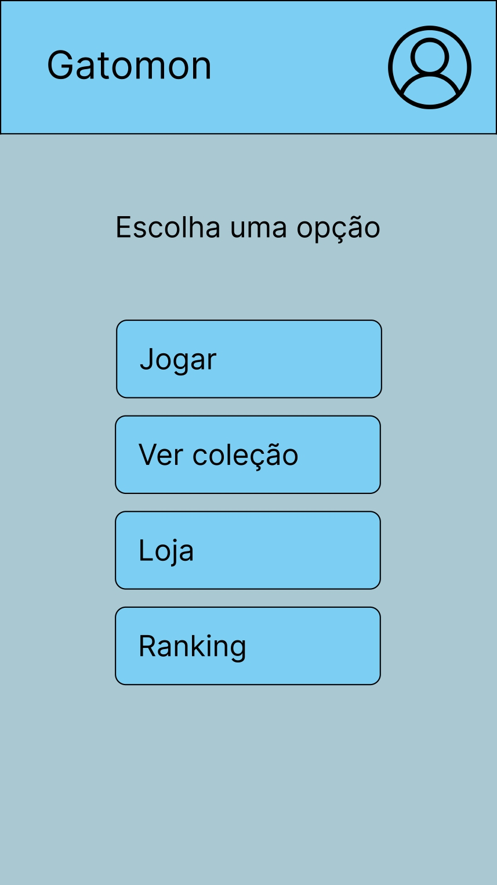
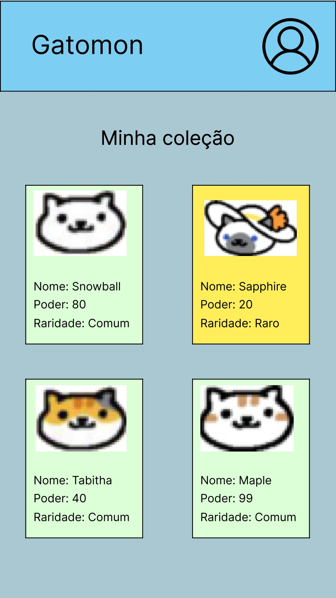
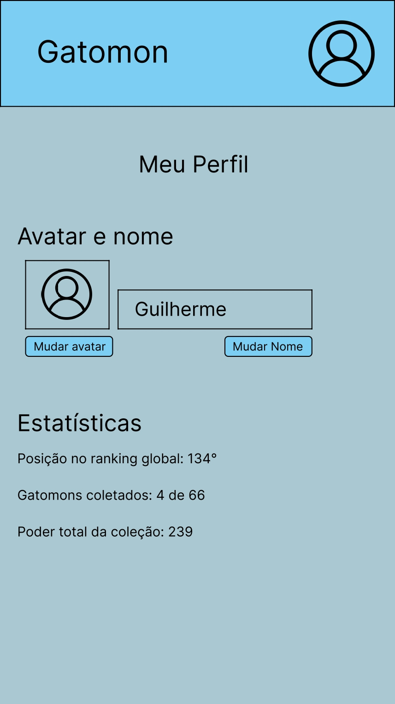
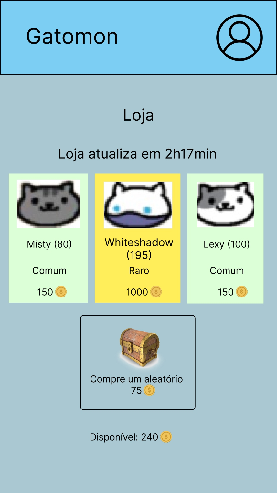
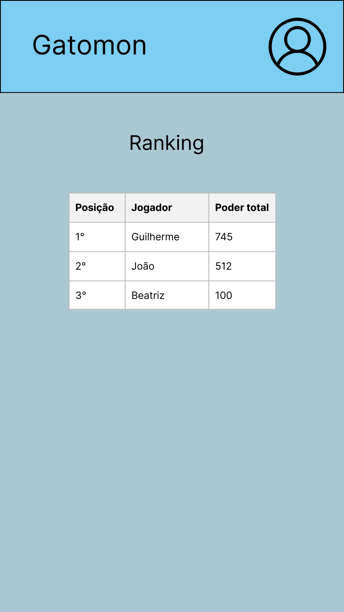
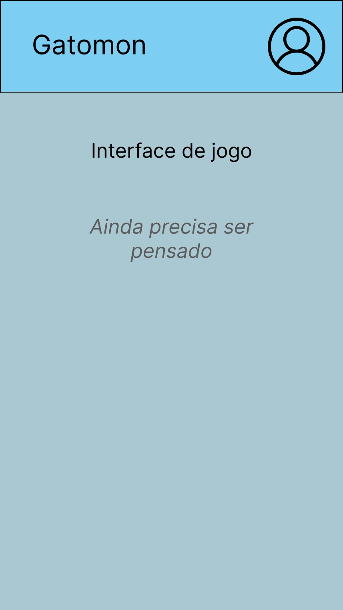

# Gatomon

## Do que se trata o aplicativo

- Está sendo desenvolvido para a disciplina de Programação de Dispositivos Móveis usando React Native junto com Expo.
- Gatomon surgiu da ideia de ser um app para colecionar/gerenciar cartas. Os dados das cartas são de um jogo de colecionar gatinhos chamado Neko Atsume (https://www.nekoatsume.com/en/). Os dados estão em uma API (https://neko-atsume.emshea.com/) que foi criado pela Emily Shea (https://emshea.com/).
- Principais funcionalidades (nem todas foram implementas ainda):
  - Criar usuários e salvar os dados no Firebase
  - Validação de login
  - Loja de cartas
  - Tela de listagem de cartas
  - Tela para mostrar e editar informações do usuário
  - Tela com ranking de usuários (por quantidade de cartas e por poder total)
  - Tela principal com algumas informações do usuário e botões para navegação

## Avaliação Final
 - [x] Correções AA2 (3)
 - [ ] Recurso inédito (2)
 - [ ] Conclusão outros requisitos (2)
 - [x] Tradução i18n (2)
 - [x] Apk (1)

## AA2

### Correções da AA1:

AA1 já estava ok

### Persistência de Dados:

Firebase nas paginas de Login e Criar conta. AsyncStorage para armazenar os dados de login e são excluidos quando o usuário faz logout.

### Alert, Modal e ActionSheet:

Alert na pagina de login e criar conta para informar que alguma coisa está incorreta. Alert também na pagina de comprar cards.

### Backlog:

- As páginas de login e criar conta agora funcionam corretamente.
- É possível criar uma conta no firebase e só é possível efetuar login se já existir uma conta.
- A tela da loja mostra somente algumas cards aleatóriamente e não todas.
- Na página do perfil de usuário (que é acessado quando clica no icone no canto superior direito), mostra um botão para logout.

### Acesso à API Remota:

Os cards são gerados a partir de uma api https://neko-atsume.emshea.com

### Recurso inédito:

Pretendo criar algum jogo muito simples para conseguir coletar moedas para o aplicativo fazer mais sentido.

### Cronograma:

- Até 06/06: Terminar as funcionalidades para criar e editar usuários
- Até 13/06: Funcionalidades para comprar cards, listar cards comprados de cada usuário, funcionalidade de mostrar mais informações de cada card
- Até 20/06: Funcionalidade de ranking
- Até 27/06: Se possível, fazer a funcionalidade do jogo, se não, implementar outras funcionalidades e polir mais o que já está implementado.

## To do

- [x] Login
- [x] Criar/editar conta para diferentes usuários
- [x] Listar informações das cards
- [x] Editar usuário
- [ ] Adicionar todos os atributos dos usuários (cards, moedas, funções de controle dos atributos) 
- [ ] Adicionar e mudar foto de perfil dos usuários
- [x] Listar coleção
- [x] Acesso a API
- [ ] Forma de adquirir moeda virtual
- [x] Loja com alguns itens aleatórios da API
- [ ] Mudar itens da loja de tempos em tempos
- [ ] Página com ranking

## AA 1

### Protótipos (ideia inicial)

#### Página de login

#### Página de cadastro

#### Página inicial

#### Listagem da coleção

#### Informações do perfil

#### Loja

#### Ranking

#### Interface de jogo

