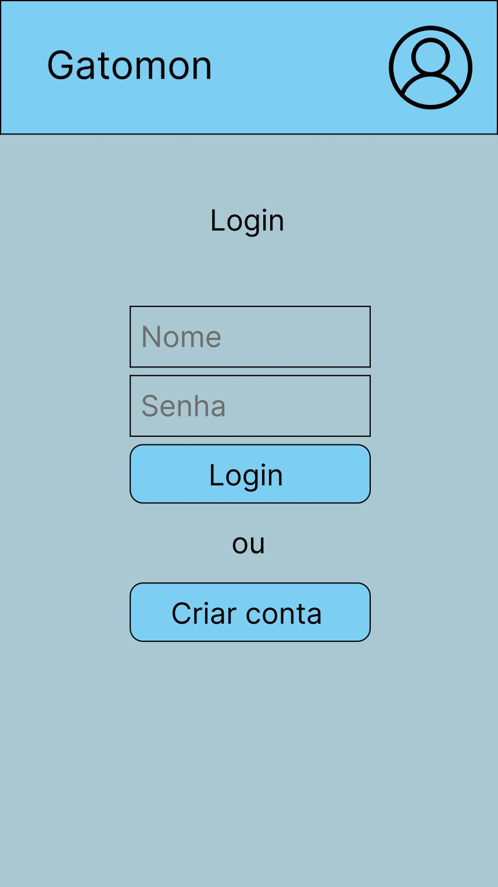
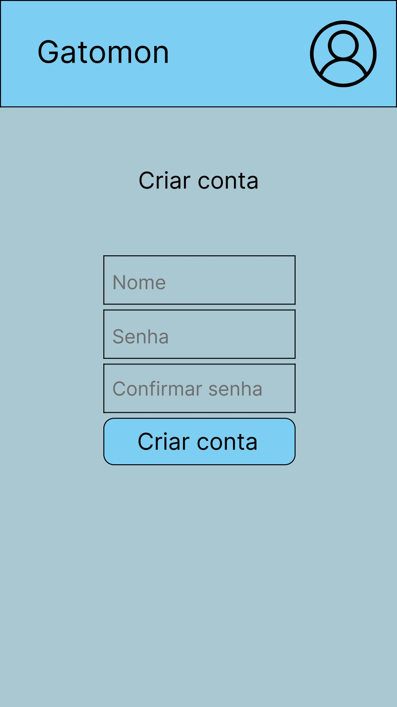
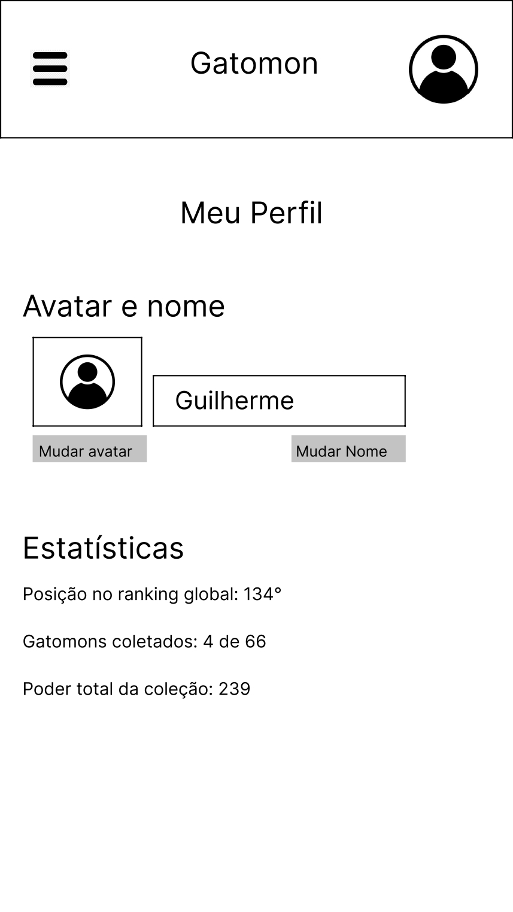
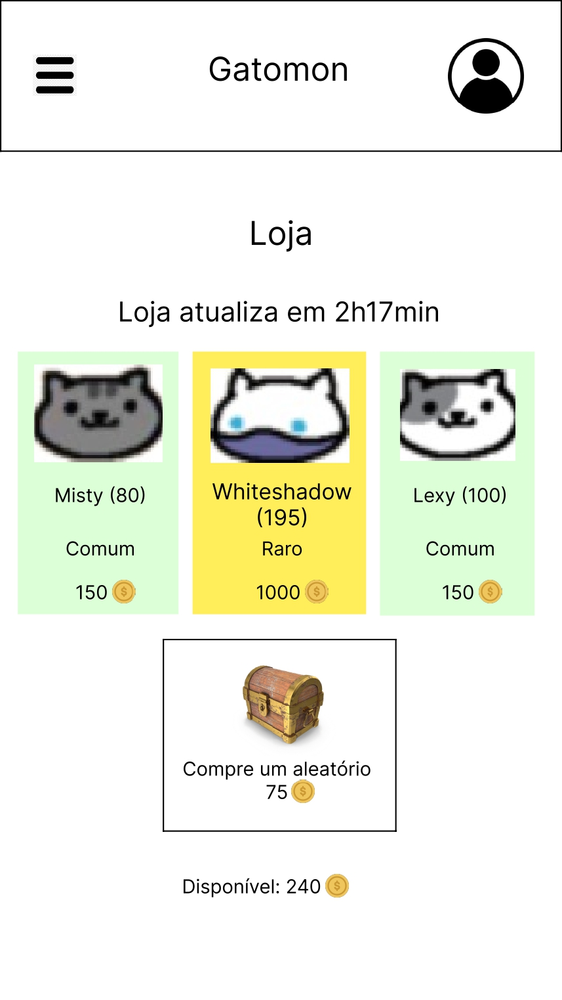
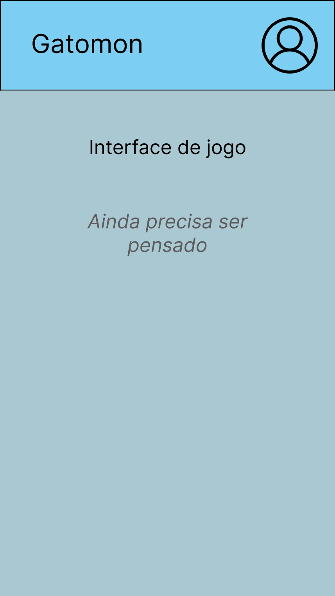

# Gatomon

## Funcionalidades
- Criar/editar conta para diferentes usuários
- Listar coleção
- Listar colecionáveis não desbloqueados
- Forma de adquirir moeda virtual
- Loja com alguns itens que se alternam de tempo em tempo
- Página para ver estatisticas e um ranking de usuários

## Protótipos

## Cronograma
