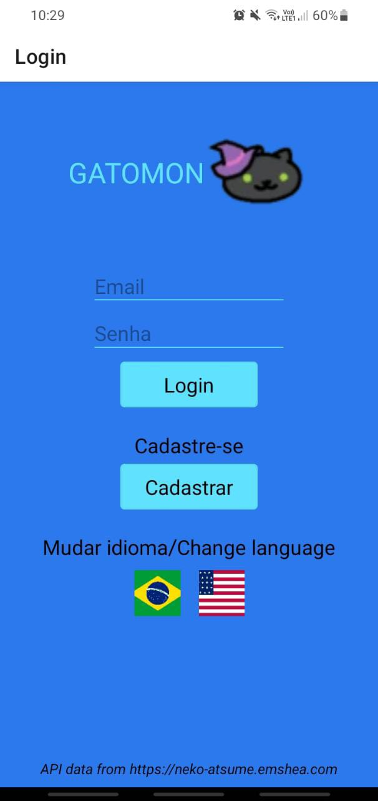
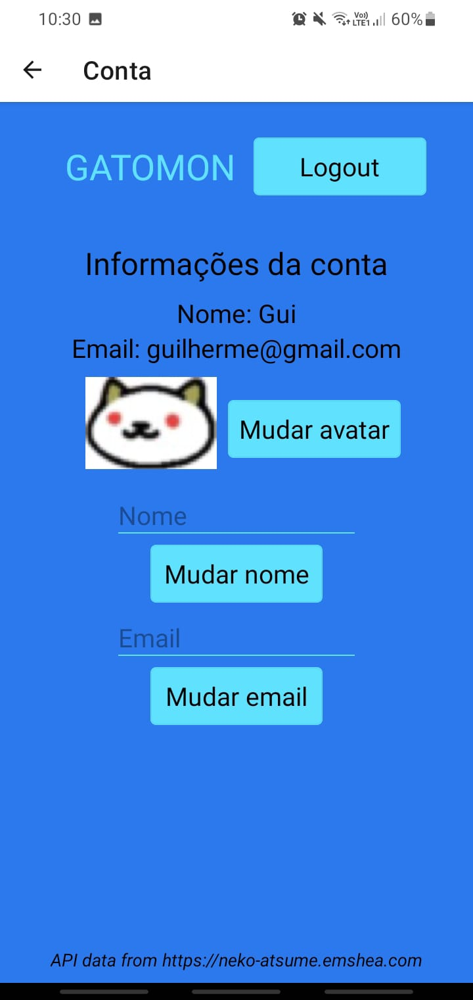
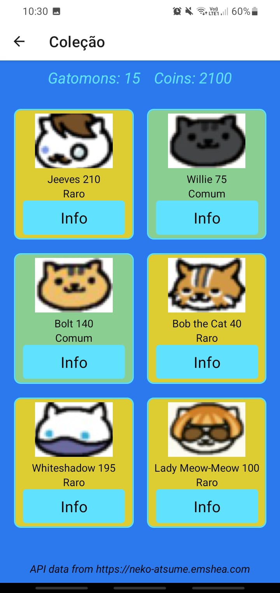

# Gatomon

## Do que se trata o aplicativo

- Foi desenvolvido para a disciplina de Programação de Dispositivos Móveis (TSI - UTFPR) usando React Native junto com Expo.
- Gatomon surgiu da ideia de ser um app para colecionar/gerenciar cartas. Os dados das cartas são de um jogo de colecionar gatinhos chamado [Neko Atsume](https://www.nekoatsume.com/en/). Os dados são de uma [API](https://neko-atsume.emshea.com/) criado pela [Emily Shea](https://emshea.com/).

- Principais funcionalidades (nem todas foram implementas ainda):
  - Criar usuários e salvar os dados no Firebase
  - Validação de login
  - Loja de cartas
  - Tela de listagem de cartas
  - Tela para mostrar e editar informações do usuário
  - Tela com ranking de usuários (por quantidade de cartas e por poder total)
  - Tela principal com algumas informações do usuário e botões para navegação

### To do

- [x] Login
- [x] Criar/editar conta para diferentes usuários
- [x] Listar informações das cards
- [x] Editar usuário
- [x] Adicionar todos os atributos dos usuários (cards, moedas, funções de controle dos atributos)
- [x] Adicionar e mudar foto de perfil dos usuários
- [x] Listar coleção
- [x] Acesso a API
- [x] Forma de adquirir moeda virtual
- [x] Loja com alguns itens aleatórios da API

### Prints

- [x] Correções AA2 (3)
- [x] Recurso inédito (2)
- [x] Conclusão outros requisitos (2)
- [x] Tradução i18n (2)
- [x] Apk (1)

### Persistência de Dados:

Firebase nas paginas de Login e Criar conta. AsyncStorage para armazenar os dados de login e são excluidos quando o usuário faz logout.

### Protótipos (ideia inicial)

#### Página de login

#### Página de cadastro

#### Página inicial

#### Listagem da coleção

#### Informações do perfil

#### Loja

#### Ranking

#### Interface de jogo

