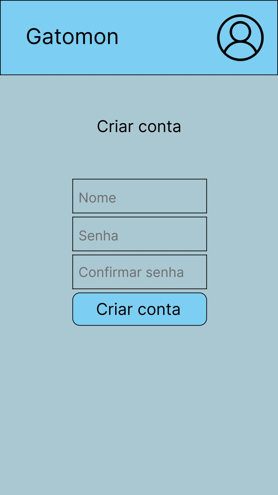
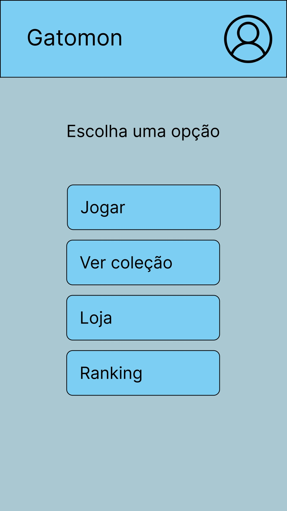
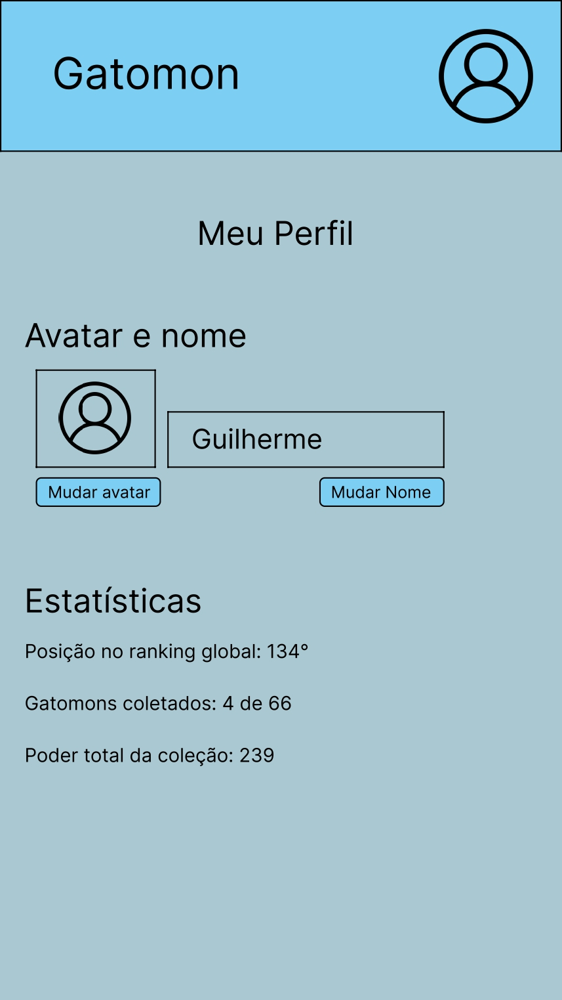
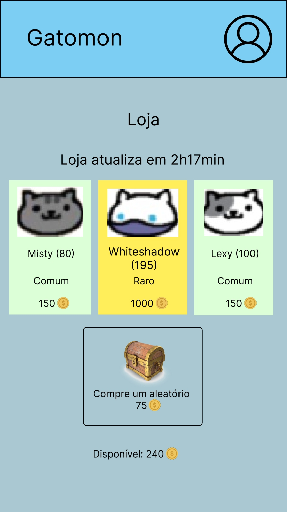
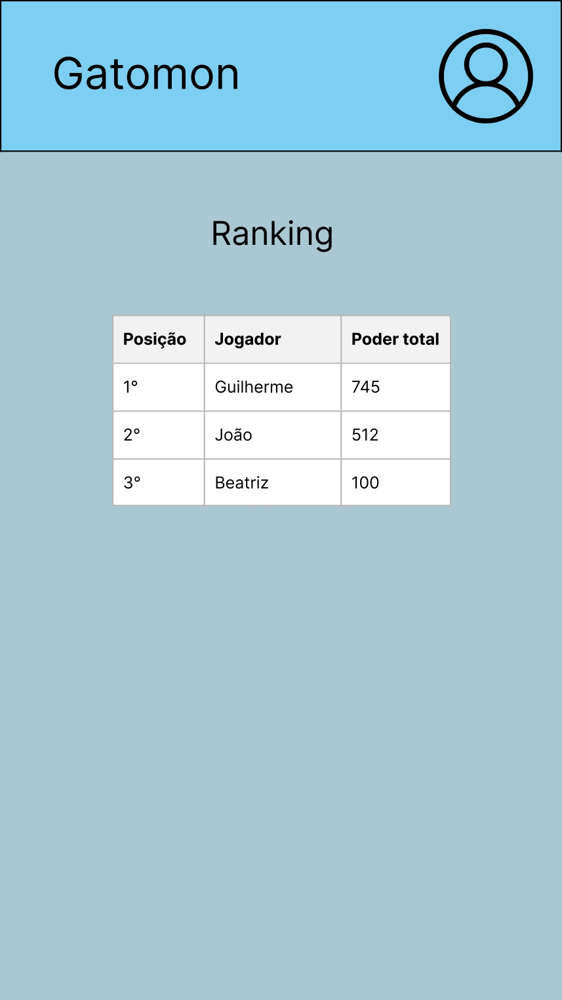
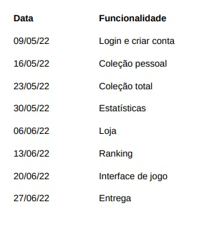

# Gatomon

## Funcionalidades
- Login
- Criar/editar conta para diferentes usuários
- Listar coleção
- Forma de adquirir moeda virtual
- Loja com alguns itens que se alternam de tempo em tempo
- Página para ver estatisticas
- Página com ranking

## Protótipos

## Cronograma

